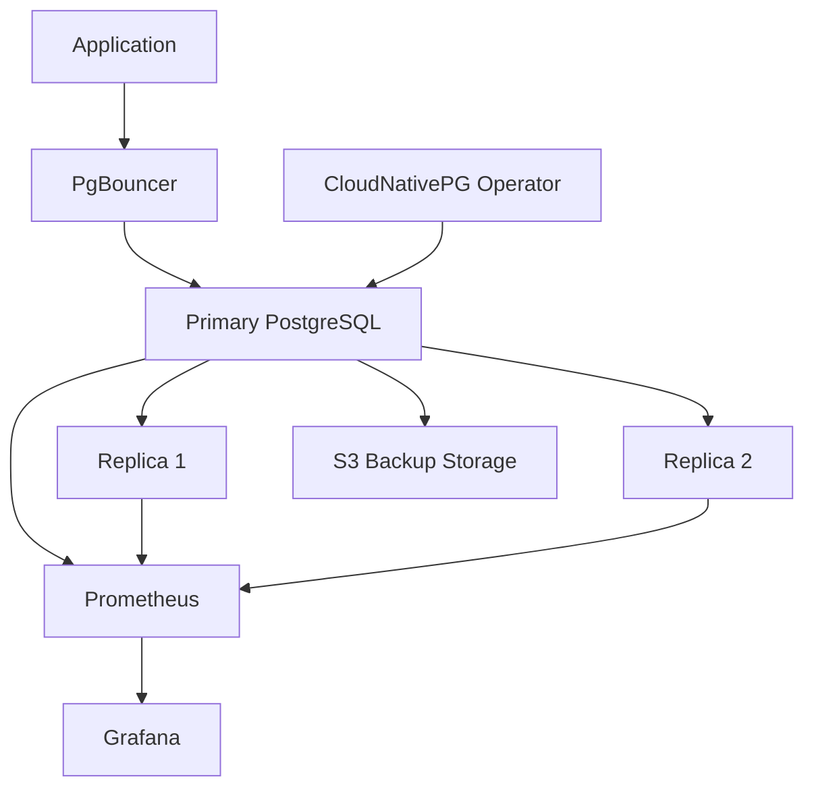
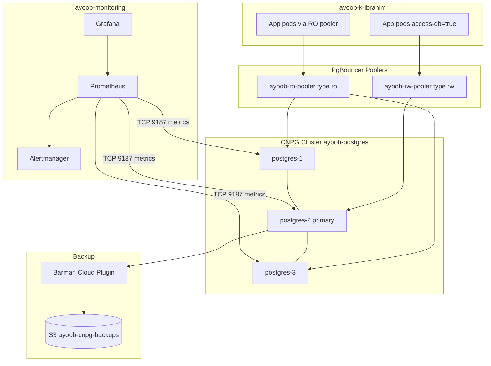
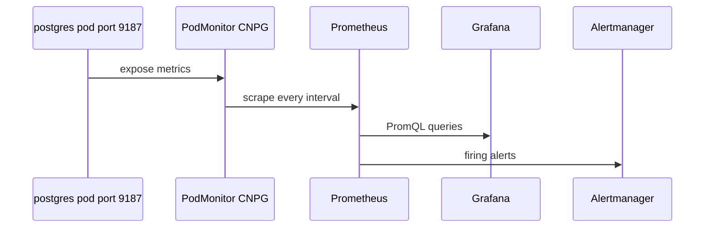

# Production PostgreSQL on Kubernetes — Architecture

**Task 4.7** · Namespace `ayoob-k-ibrahim` · Cluster context `kubenine-intern-pinniped` (shared Civo/k3s)

---

## 1. Overview

This deployment runs a **production-style PostgreSQL** stack on Kubernetes using **CloudNativePG (CNPG)**. It provides:

- **High availability** — 3-instance cluster with automatic failover (`unsupervised`)
- **Connection pooling** — PgBouncer poolers for read-write and read-only traffic
- **Disaster recovery** — Barman backups to **S3** (`ayoob-cnpg-backups`)
- **Network isolation** — `NetworkPolicy` restricts who can reach the database and metrics
- **Observability** — Prometheus scrapes CNPG metrics; Grafana visualizes; Alertmanager routes alerts

---

## 2. Namespaces and components

| Namespace | Components |
|-----------|------------|
| `ayoob-k-ibrahim` | CNPG `Cluster` `ayoob-postgres`, poolers, secrets, backups, `NetworkPolicy`, `PrometheusRule` |
| `ayoob-monitoring` | Helm release `ayoob-prometheus-stack` (Prometheus, Grafana, Alertmanager) |
| `cnpg-system` | CNPG operator (cluster-scoped; manages clusters) |

**Application database:** `appdb` · **App user:** `ayoob` (non-superuser)

---

## 3. High-level architecture

### 3.1 Overview diagram



### 3.2 Detailed diagram (namespaces and services)



---

## 4. PostgreSQL cluster (CNPG)

**Manifest:** `02-cluster.yaml`

| Setting | Value |
|---------|--------|
| Instances | 3 |
| Image | `ghcr.io/cloudnative-pg/postgresql:17` |
| Storage | `civo-volume`, 5Gi per instance |
| Failover | `primaryUpdateStrategy: unsupervised` |
| Monitoring | `enablePodMonitor: true` |

CNPG runs one **primary** and two **streaming replicas**. The operator handles promotion if the primary fails (demonstrated by deleting the primary pod).

**Services (created by operator):**

- `ayoob-postgres-rw` — primary only
- `ayoob-postgres-ro` — replicas
- `ayoob-postgres-r` — any instance (internal)

**Metrics:** Each postgres pod exposes port **9187** (`/metrics`) for the CNPG exporter.

---

## 5. Connection poolers

| Pooler | Type | Purpose | Manifest |
|--------|------|---------|----------|
| `ayoob-rw-pooler` | `rw` | Writes and transactions to primary | `03-rw-pooler.yaml` |
| `ayoob-ro-pooler` | `ro` | Read-only queries to replicas | `04-ro-pooler.yaml` |

PgBouncer uses **transaction pooling**. Apps should use pooler services in production instead of hitting postgres pods directly.

**Read/write split demo:**

- Via **RW** service/pooler: `pg_is_in_recovery() = f`, INSERT allowed
- Via **RO** service/pooler: `pg_is_in_recovery() = t`, SELECT allowed, INSERT rejected

---

## 6. Backups and recovery

**S3 bucket:** `ayoob-cnpg-backups`  
**Credentials:** `06-s3-secret.yaml` → Secret `ayoob-s3-creds`  
**Backup spec:** `07-backup-config.yaml` (Barman object store)

| Resource | Manifest | Role |
|----------|----------|------|
| `ScheduledBackup` | `08-scheduled-backup.yaml` | Cron `0 */6 * * *` (every 6 hours) |
| `Backup` | `09-manual-backup.yaml` | On-demand backup |

Backups land under S3 paths such as `base/` and `wals/` for point-in-time recovery. The metric `cnpg_collector_last_available_backup_timestamp` is reported on the **primary** pod.

---

## 7. Network security

**Manifest:** `05-networkpolicy.yaml`  
**Applies to:** Pods with `cnpg.io/cluster: ayoob-postgres`

| Ingress source | Ports | Purpose |
|----------------|-------|---------|
| Pods with `access-db: "true"` | all | Authorized application pods |
| Pods `cnpg.io/podRole: pooler` | all | PgBouncer poolers |
| Namespace `cnpg-system` | all | CNPG operator reconciliation |
| Same-cluster CNPG pods | 5432, 8000 | Replication and operator API |
| Namespace `ayoob-monitoring` | **9187** | Prometheus metrics scrape |

**Default deny:** Any pod without matching rules cannot connect (demo: unauthorized pod → connection refused).

**Monitoring:** Prometheus runs in `ayoob-monitoring`. Without ingress on port **9187**, scrape targets showed `connection refused`. A dedicated rule allows only the metrics port from the monitoring namespace.

---

## 8. Monitoring and alerting

### 8.1 Stack deployment

**Helm:** `monitoring/kube-prometheus-stack.yaml` in namespace `ayoob-monitoring`

- Uses existing cluster **Prometheus Operator** (`prometheusOperator.enabled: false`)
- **Disabled** cluster-wide scrapes (kubelet, apiserver, node-exporter, etc.) to avoid OOM on shared cluster
- Prometheus: **4Gi** memory limit, **1d** retention
- Scrapes scoped to CNPG `PodMonitor` + Grafana/Alertmanager `ServiceMonitor`

### 8.2 Metrics flow



1. CNPG enables `PodMonitor` on the cluster.
2. Prometheus discovers pods in `ayoob-k-ibrahim` with label `cnpg.io/cluster: ayoob-postgres`.
3. Grafana uses the provisioned Prometheus datasource.
4. `PrometheusRule` `ayoob-cnpg-alerts` (`10-cnpg-alerts.yaml`) defines alert expressions.

### 8.3 Alert rules

| Alert | Intent |
|-------|--------|
| `CNPGStreamingReplicasLow` | Fewer than 2 streaming replicas |
| `CNPGReplicationLagHigh` | Lag greater than 30s |
| `CNPGBackupStale` | No backup in 24h |

**Label:** `release: ayoob-prometheus-stack` so Prometheus picks up the rule.

**Note:** In Grafana Explore, queries with `namespace="ayoob-k-ibrahim"` return data. Some series may not include `cluster="ayoob-postgres"`; align alert expressions with labels present on scraped metrics.

### 8.4 Key metrics (demo)

```promql
up{namespace="ayoob-k-ibrahim", endpoint="metrics"}
cnpg_pg_replication_lag{namespace="ayoob-k-ibrahim"}
max(cnpg_pg_replication_streaming_replicas{namespace="ayoob-k-ibrahim"})
cnpg_collector_last_available_backup_timestamp{namespace="ayoob-k-ibrahim"}
```

---

## 9. Manifest index

| File | Resource |
|------|----------|
| `01-secret.yaml` | App DB credentials |
| `02-cluster.yaml` | CNPG Cluster |
| `03-rw-pooler.yaml` | RW pooler |
| `04-ro-pooler.yaml` | RO pooler |
| `05-networkpolicy.yaml` | NetworkPolicy |
| `06-s3-secret.yaml` | S3 credentials |
| `07-backup-config.yaml` | Backup / Barman config fragment |
| `08-scheduled-backup.yaml` | ScheduledBackup |
| `09-manual-backup.yaml` | Manual Backup CR |
| `10-cnpg-alerts.yaml` | PrometheusRule |
| `monitoring/kube-prometheus-stack.yaml` | Helm values |
| `monitoring/cnpg-operator.yaml` | Operator install reference |

---

## 10. Operational notes

**Failover:** Delete primary pod; CNPG elects new primary; RW service follows primary.

**Prometheus OOM:** Caused by too many default scrape targets; fixed by disabling kube component exporters and raising memory to 4Gi.

**Port-forwards (demos):**

```bash
kubectl port-forward -n ayoob-monitoring svc/ayoob-prometheus-stack-kub-prometheus 9090:9090
kubectl port-forward -n ayoob-monitoring svc/ayoob-prometheus-stack-grafana 3000:80
```

**Secrets:** Do not commit real passwords to git; use placeholders and inject via CI or sealed secrets.

---

## 11. Design decisions (summary)

1. **CNPG over hand-rolled StatefulSet** — built-in HA, backup CRDs, PodMonitor.
2. **Poolers** — protect postgres from connection storms; clean RW/RO split.
3. **S3 backups** — off-cluster recovery path.
4. **NetworkPolicy** — defense in depth on a shared internship cluster.
5. **Dedicated monitoring namespace** — isolates Prometheus/Grafana; explicit netpol for port 9187.
6. **Minimal scrape footprint** — stable Prometheus on resource-constrained shared cluster.
