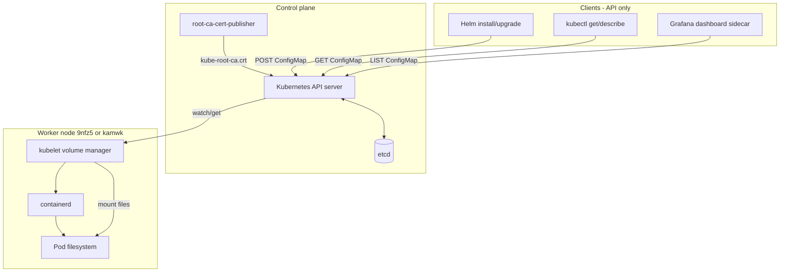
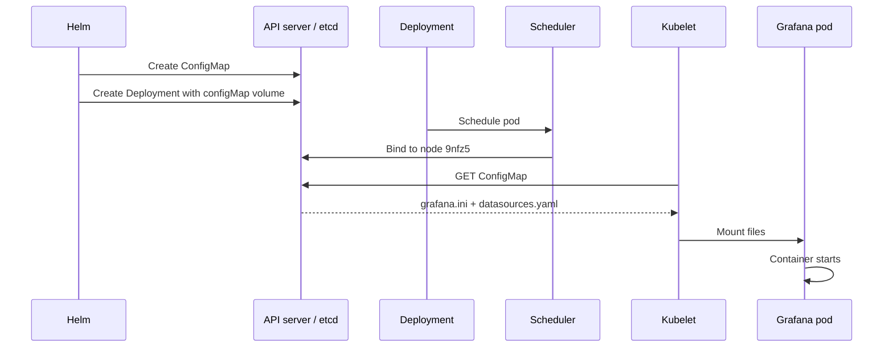
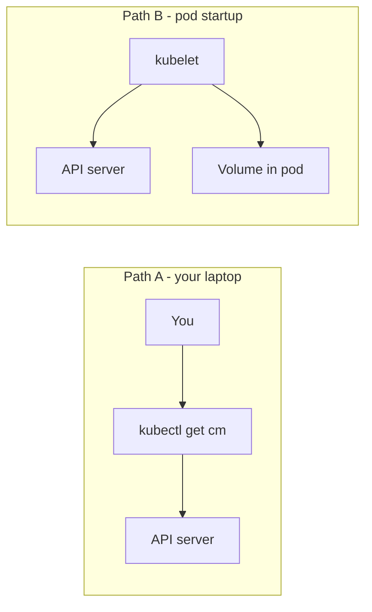
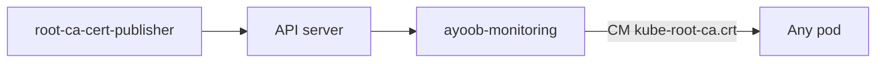
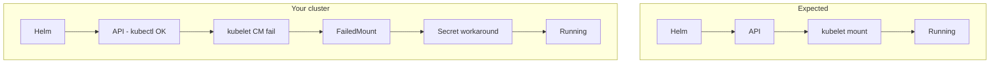

# Architecture: How ConfigMaps Reach a Pod

**Cluster:** Civo k3s (`kubenine`) · **Namespace:** `ayoob-monitoring`  
**Related:** [TROUBLESHOOTING-configmap-and-grafana.md](./TROUBLESHOOTING-configmap-and-grafana.md) (full diagnosis and fixes)

This document is the **architecture-only** reference with all diagrams. Use it to understand *why* `kubectl get configmap` can succeed while a pod still fails with `ConfigMap not found`.

---

## Table of contents

1. [Big picture](#1-big-picture-control-plane-vs-worker-node)
2. [Normal flow (Grafana example)](#2-normal-flow--step-by-step-grafana-example)
3. [Two clients: kubectl vs kubelet](#3-two-clients-kubectl-vs-kubelet)
4. [Four paths in the monitoring stack](#4-four-paths-in-the-monitoring-stack)
5. [kube-root-ca.crt](#5-kube-rootcacrt-in-the-same-architecture)
6. [Healthy vs your cluster](#6-healthy-cluster-vs-your-cluster)
7. [Failure map](#7-where-failures-happen)
8. [ASCII diagram](#8-ascii-diagram-plain-text)

---

## 1. Big picture (control plane vs worker node)

| Layer | Components | Role |
|-------|------------|------|
| **Control plane** | API server, etcd, controllers (`root-ca-cert-publisher`), Helm/kubectl | Store and manage objects |
| **Worker node** | kubelet, containerd | Run pods; **mount volumes** into containers |

**Critical idea:** `kubectl get configmap` uses the **API server**. Pod volume mounts use the **kubelet** on the scheduled node. Those paths can disagree.

### Diagram — full stack



---

## 2. Normal flow — step by step (Grafana example)

**Object:** `ConfigMap/ayoob-monitoring/ayoob-prometheus-stack-grafana`  
**Consumer:** Grafana pod (`ayoob-prometheus-stack-grafana`)

### Sequence diagram



### Steps

| Step | Who | Action |
|------|-----|--------|
| 1 | Helm | Apply ConfigMap YAML |
| 2 | API/etcd | Store `ayoob-prometheus-stack-grafana` |
| 3 | Helm | Deployment references CM in `volumes` |
| 4 | Scheduler | Place pod on a node |
| 5 | Kubelet | `SetUp` volume — fetch CM from API |
| 6 | Kubelet | Mount via `subPath` (e.g. `grafana.ini`) |
| 7 | Container | Read config; process starts |

### Volume YAML example

```yaml
volumes:
  - name: config
    configMap:
      name: ayoob-prometheus-stack-grafana
containers:
  - name: grafana
    volumeMounts:
      - name: config
        mountPath: /etc/grafana/grafana.ini
        subPath: grafana.ini
```

---

## 3. Two clients: kubectl vs kubelet



| Path | Answers |
|------|---------|
| **A** | Does the ConfigMap exist in etcd/API? |
| **B** | Can this node mount it into a **new** pod **now**? |

**Your cluster:** A = yes, B = no (for ConfigMap). B = yes (for Secret) → Secret workaround.

---

## 4. Four paths in the monitoring stack

```mermaid
flowchart TB
  subgraph A [A - Volume mount - FAILED]
    CM1[CM grafana config]
    GP1[Grafana pod]
    CM1 -->|kubelet| GP1
  end

  subgraph B [B - Sidecar API watch - FAILED]
    CM2[27 dashboard CMs]
    SC[grafana-sc-dashboard]
    GP2[Grafana pod]
    CM2 -->|API list| SC --> GP2
  end

  subgraph C [C - Secret mount - WORKS]
    SEC[ayoob-grafana-config-secret]
    GP3[Grafana pod]
    SEC -->|kubelet| GP3
  end

  subgraph D [D - Manual import - WORKS]
    CM3[dashboard CMs]
    EXP[Export JSON]
    UI[Grafana UI/API]
    CM3 -.-> EXP --> UI
  end
```



| Path | How | Your result |
|------|-----|-------------|
| A | kubelet mounts ConfigMap | Failed |
| B | Sidecar copies from CM via API | 504 error |
| C | Secret + Deployment patch | Running |
| D | Python export + import | Dashboards visible |

---

## 5. kube-root-ca.crt in the same architecture



Missing in `ayoob-monitoring` on your cluster → manual copy from `kube-system` or admin fixes controller.

---

## 6. Healthy cluster vs your cluster



| Check | Healthy | Your cluster |
|-------|---------|--------------|
| CM in API | Yes | Yes |
| kube-root-ca.crt | Yes | No (fixed manually) |
| New CM mount | Yes | No |
| New Secret mount | Yes | Yes |
| Sidecar list CM | Yes | 504 |

---

## 7. Where failures happen

| Step | Component | Symptom |
|------|-----------|---------|
| 1 | Helm | CM never created |
| 2 | API/etcd | Stale watch / RV too large |
| 3 | root-ca publisher | No kube-root-ca.crt |
| 4 | Scheduler | hostPort (node-exporter) |
| 5 | Kubelet | ConfigMap not found |
| 6 | Kubelet | Secret mount OK |
| 7 | Sidecar | API timeout |
| 8 | Export | Empty JSON (jsonpath dots) |

See [TROUBLESHOOTING-configmap-and-grafana.md](./TROUBLESHOOTING-configmap-and-grafana.md) Layers 1–7 for fixes.

---

## 8. ASCII diagram (plain text)

```
 LAPTOP              CONTROL PLANE                 WORKER NODE
 -------             --------------                 ------------

 helm upgrade ----> API Server <-----> etcd
 kubectl get cm ->     |
                       | root-ca-cert-publisher
 kubectl: CM EXISTS    |
                       | GET (watch)
                       v
                   KUBELET ------> mount into pod
                       |
                       X FAILED (ConfigMap) on your cluster
                       |
                   WORKAROUND: Secret mount --> Pod Running
```

---

## Quick reference — your resources

| Resource | Type | Role in architecture |
|----------|------|----------------------|
| `ayoob-prometheus-stack-grafana` | ConfigMap | Grafana `grafana.ini` (mount failed) |
| `ayoob-grafana-config-secret` | Secret | Workaround mount (works) |
| `kube-root-ca.crt` | ConfigMap | CA for projected SA volume |
| `grafana_dashboard=1` CMs | ConfigMap | Pre-built dashboards (sidecar/import) |
| `task-2-54-loki` | Service | Logs (separate from CM path) |

---

*Part of internship monitoring docs — Tasks 2.52–2.54.*
