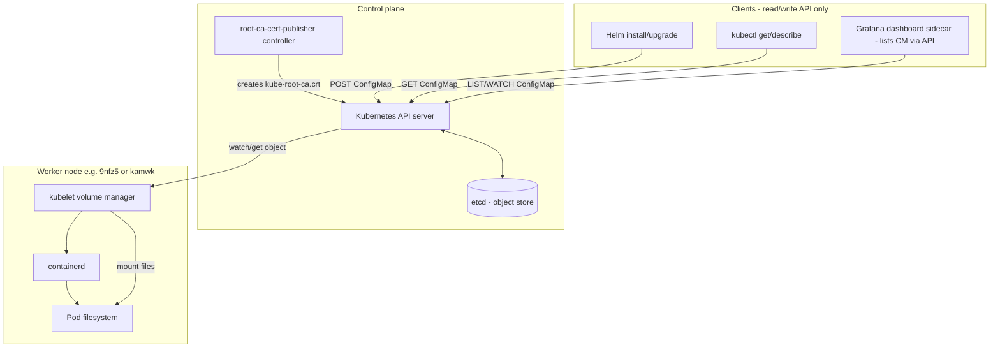
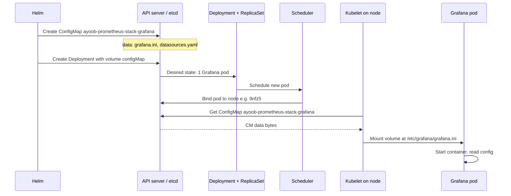
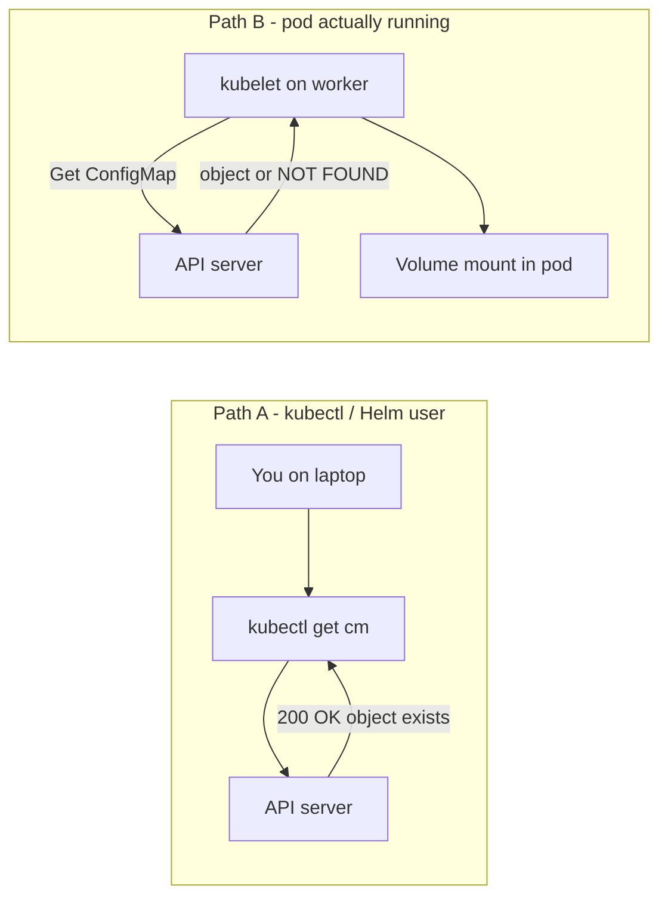
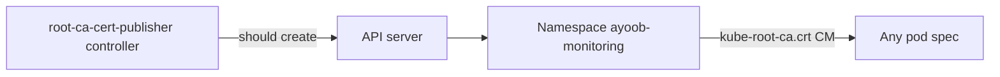
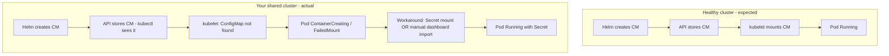

# Troubleshooting Guide: ConfigMap Mount Issues, Grafana, and Monitoring Stack

**Cluster:** Civo k3s internship (`kubenine`)  
**Namespace:** `ayoob-monitoring`  
**Helm release:** `ayoob-prometheus-stack`  
**Context:** Shared cluster with multiple interns; disk/API pressure common.

This document explains the problems encountered during Tasks 2.52–2.54, the diagnosis steps used, workarounds that worked, and what requires a platform admin to fix permanently.

**Architecture diagrams (standalone):** [ARCHITECTURE-configmap-to-pod.md](./ARCHITECTURE-configmap-to-pod.md) — all Mermaid + ASCII diagrams in one place for study.

---

## Table of contents

1. [Symptoms summary](#1-symptoms-summary)
2. [How ConfigMaps reach a pod](#2-how-configmaps-reach-a-pod) · [standalone diagrams](./ARCHITECTURE-configmap-to-pod.md)
   - [2.1 Big picture](#21-big-picture-control-plane-vs-worker-node)
   - [2.2 Normal flow (Grafana)](#22-normal-flow--step-by-step-your-grafana-example)
   - [2.3 kubectl vs kubelet](#23-two-clients-two-views-of-the-same-configmap)
   - [2.4 Four paths (mount / sidecar / secret / import)](#24-related-paths-in-the-monitoring-stack)
   - [2.5 kube-root-ca.crt](#25-kube-root-cacrt-in-the-same-architecture)
   - [2.6 Your cluster vs healthy](#26-what-broke-on-your-cluster-overlay-on-normal-architecture)
   - [2.7 Failure map](#27-where-failures-happen-quick-reference)
   - [2.8 ASCII diagram](#28-ascii-diagram-plain-text-view)
3. [Layer 1: Missing kube-root-ca.crt](#3-layer-1-missing-kube-root-cacrt)
4. [Layer 2: ConfigMap not found but kubectl sees it](#4-layer-2-configmap-not-found-but-kubectl-sees-it)
5. [Layer 3: Secret volume workaround (Grafana)](#5-layer-3-secret-volume-workaround-grafana)
6. [Layer 4: Node-exporter Pending (host port)](#6-layer-4-node-exporter-pending-host-port)
7. [Layer 5: Empty Grafana dashboards](#7-layer-5-empty-grafana-dashboards)
8. [Layer 6: Loki datasource connection](#8-layer-6-loki-datasource-connection)
9. [Layer 7: Grafana panel No data](#9-layer-7-grafana-panel-no-data)
10. [Master troubleshooting flowchart](#10-master-troubleshooting-flowchart)
11. [Command cheat sheet](#11-command-cheat-sheet)
12. [Files in this repo](#12-files-in-this-repo)
13. [What to escalate to admin](#13-what-to-escalate-to-admin)
14. [Mental model (one paragraph)](#14-mental-model-one-paragraph)

---

## 1. Symptoms summary

Three problems looked like one Grafana bug. They were **separate layers**:

| ID | Symptom | Typical message / sign |
|----|---------|----------------------|
| A | Grafana stuck `ContainerCreating` | `FailedMount` in pod events |
| B | ConfigMap "not found" | `configmap "ayoob-prometheus-stack-grafana" not found` |
| C | API vs kubelet mismatch | `kubectl get cm` shows CM exists |
| D | node-exporter `Pending` | `didn't have free ports for the requested pod ports` |
| E | Dashboard sidecar crash | `504 ResourceVersionTooLarge` |
| F | Empty exported JSON files | `JSONDecodeError: Expecting value` on import |

**Key lesson:** `kubectl get configmap` succeeding does **not** prove the kubelet can mount that ConfigMap into a new pod.

---

## 2. How ConfigMaps reach a pod

This section is the **architecture reference** for everything else in this document. Read it first when debugging mount or “ConfigMap not found” issues.

> **Same content as a focused doc:** [ARCHITECTURE-configmap-to-pod.md](./ARCHITECTURE-configmap-to-pod.md) (diagrams only, easier to print/share).

### 2.1 Big picture (control plane vs worker node)

Kubernetes splits work into two places:

| Layer | Components | Role |
|-------|------------|------|
| **Control plane** | API server, etcd, controllers (incl. `root-ca-cert-publisher`), Helm/kubectl clients | Store and manage objects (ConfigMaps, Pods, Secrets) |
| **Worker node** | kubelet, container runtime (containerd) | Run pods, **mount volumes** into container filesystems |

**Critical idea:** When you run `kubectl get configmap`, you talk to the **API server**. When a pod mounts a ConfigMap, the **kubelet on that node** must fetch the same object. Those are two different code paths. They can disagree on a sick cluster.



### 2.2 Normal flow — step by step (your Grafana example)

This is what **should** happen for `ayoob-prometheus-stack-grafana`:



**Step-by-step (numbered):**

| Step | Who | What happens |
|------|-----|----------------|
| 1 | **Helm** | Renders chart templates → applies ConfigMap YAML to API |
| 2 | **API / etcd** | Stores object `ConfigMap/ayoob-monitoring/ayoob-prometheus-stack-grafana` |
| 3 | **Helm** | Creates Deployment; pod template includes `volumes[].configMap` |
| 4 | **Scheduler** | Assigns pod to a node (e.g. `9nfz5`) |
| 5 | **Kubelet** | Before starting containers: **SetUp** volume → fetch CM from API |
| 6 | **Kubelet** | Mounts files (often via `subPath`, e.g. `grafana.ini`) into pod |
| 7 | **Container** | Starts; Grafana reads `/etc/grafana/grafana.ini` |

**Example volume snippet (from Deployment):**

```yaml
volumes:
  - name: config
    configMap:
      name: ayoob-prometheus-stack-grafana
containers:
  - name: grafana
    volumeMounts:
      - name: config
        mountPath: /etc/grafana/grafana.ini
        subPath: grafana.ini
```

### 2.3 Two clients, two views of the same ConfigMap



| Path | Tool | Question it answers |
|------|------|---------------------|
| **A** | `kubectl get configmap` | Does the object exist in the API/etcd? |
| **B** | kubelet volume plugin | Can **this node** mount that object **right now** into a **new** pod? |

**On your cluster:** Path A succeeded; Path B failed for ConfigMaps (but Path B worked for **Secrets**). That is why the Secret workaround fixed Grafana.

### 2.4 Related paths in the monitoring stack

ConfigMaps are used in **three different ways** in your setup. Do not confuse them:

```mermaid
flowchart TB
  subgraph mount [A - Volume mount into pod - BROKEN for new pods]
    CM1[ConfigMap ayoob-prometheus-stack-grafana]
    CM2[ConfigMap grafana-config-dashboards]
    GPod[Grafana pod]
    CM1 -->|kubelet mount| GPod
    CM2 -->|kubelet mount| GPod
  end

  subgraph sidecar [B - Sidecar reads API - BROKEN API 504]
    CM3[27x CM with label grafana_dashboard=1]
    SC[grafana-sc-dashboard container]
    CM3 -->|LIST via Kubernetes API| SC
    SC -->|write files| GPod2[Grafana pod /tmp/dashboards]
  end

  subgraph secret [C - Secret mount workaround - WORKS]
    SEC[Secret ayoob-grafana-config-secret]
    GPod3[Grafana pod]
    SEC -->|kubelet mount| GPod3
  end

  subgraph manual [D - Manual import - WORKS]
    CM4[Dashboard CM in API]
    Export[Export JSON on laptop]
    API_UI[Grafana Import API / UI]
    CM4 -.->|kubectl get -o json| Export
    Export --> API_UI
  end
```



| Path | Mechanism | Your cluster |
|------|-----------|--------------|
| **A** Volume mount | kubelet mounts CM as files | Failed (`ConfigMap not found`) |
| **B** Dashboard sidecar | Sidecar watches CM via API | Crashed (`504 ResourceVersionTooLarge`) |
| **C** Secret workaround | Same data in Secret; patch Deployment | **Working** |
| **D** Manual import | Copy JSON from CM with Python; import to Grafana | **Working** |

### 2.5 `kube-root-ca.crt` in the same architecture

Every pod also gets a **projected** service-account volume that includes ConfigMap `kube-root-ca.crt`:



If `kube-root-ca.crt` is missing in `ayoob-monitoring`, the controller chain is broken. Fix: [Layer 1](#3-layer-1-missing-kube-root-cacrt) (manual copy or admin repair).

### 2.6 What broke on **your** cluster (overlay on normal architecture)



| Stage | Healthy | Your cluster |
|-------|---------|--------------|
| CM in API | Yes | Yes |
| `kube-root-ca.crt` in namespace | Yes | **No** (until manual copy) |
| Kubelet mounts new CM | Yes | **No** |
| Kubelet mounts new Secret | Yes | **Yes** |
| Sidecar lists all CMs | Yes | **504 / RV too large** |

### 2.7 Where failures happen (quick reference)

| Step | Component | Failure example | Doc section |
|------|-----------|-----------------|-------------|
| 1 | Helm | Partial install; wrong chart path | Layer 2 |
| 2 | API/etcd | CM exists but watch lag | Layer 2, 5 |
| 3 | `root-ca-cert-publisher` | No `kube-root-ca.crt` | Layer 1 |
| 4 | Scheduler | hostPort conflict (not CM) | Layer 4 |
| 5 | Kubelet CM plugin | `ConfigMap not found` | Layer 2, 3 |
| 6 | Kubelet Secret plugin | OK → use Secret workaround | Layer 3 |
| 7 | Sidecar + API | `ResourceVersionTooLarge` | Layer 5 |
| 8 | jsonpath export | Empty `.json` files | Layer 5 |

### 2.8 ASCII diagram (plain-text view)

```
  YOUR LAPTOP                         CONTROL PLANE                    WORKER NODE (e.g. 9nfz5)
  -----------                         -------------                    ---------------------------

  helm upgrade  ----------------->   API Server  <--------->  etcd
  kubectl get cm ---------------->       |              (ConfigMap objects stored here)
                                         |
                    root-ca-cert-publisher (should create kube-root-ca.crt per namespace)
                                         |
  kubectl sees CM EXISTS                 |
                                         |  watch / GET
                                         v
                                    KUBELET  ---------->  mount volume into pod dir
                                         |                    |
                                         |                    v
                                         X  (FAILED HERE       GRAFANA CONTAINER
                                         on your cluster)      reads grafana.ini

  WORKAROUND: patch Deployment to use Secret instead of ConfigMap
                                    KUBELET  ---------->  mount Secret OK --> Pod Running
```

---


## 3. Layer 1: Missing kube-root-ca.crt

### What it is

The **`root-ca-cert-publisher`** controller (part of kube-controller-manager / k3s) should create ConfigMap **`kube-root-ca.crt`** in every namespace so pods can trust the cluster CA via projected service account volumes.

### How we detected it

```bash
kubectl get configmap kube-root-ca.crt -n ayoob-monitoring
# Error: NotFound

kubectl get configmap kube-root-ca.crt -n kube-system
# Exists
```

### Impact

- Projected volume `kube-api-access-*` references `kube-root-ca.crt`.
- Can contribute to volume mount failures for pods in affected namespaces.

### Manual fix (per namespace — you can do this)

```bash
kubectl get configmap kube-root-ca.crt -n kube-system -o yaml \
  | sed 's/namespace: kube-system/namespace: ayoob-monitoring/' \
  | grep -v 'resourceVersion:\|uid:\|creationTimestamp:' \
  | kubectl apply -f -
```

Verify:

```bash
kubectl get configmap kube-root-ca.crt -n ayoob-monitoring
```

Restart affected pods so volumes remount:

```bash
kubectl delete pod -n ayoob-monitoring -l app.kubernetes.io/name=grafana
```

### Permanent fix (cluster admin only)

- Repair/restart kube-controller-manager or k3s server.
- Confirm `root-ca-cert-publisher` runs without errors.
- New namespaces then receive `kube-root-ca.crt` automatically.

**Scope:** Manual copy fixes **one namespace**, not the entire cluster for all users.

---

## 4. Layer 2: ConfigMap not found but kubectl sees it

### Symptom

```text
Warning  FailedMount  MountVolume.SetUp failed for volume "config":
  configmap "ayoob-prometheus-stack-grafana" not found
```

Meanwhile:

```bash
kubectl get configmap ayoob-prometheus-stack-grafana -n ayoob-monitoring
# NAME exists, DATA 1
```

### Meaning

| Client | Sees ConfigMap? |
|--------|-----------------|
| kubectl (API) | Yes |
| Kubelet on worker node | No (or stale / cannot sync) |

This is **not** "Helm forgot the ConfigMap." It is a **kubelet ↔ API** or **cluster/etcd** issue on an overloaded shared cluster.

### Diagnosis steps (in order)

**Step 1 — Confirm object exists**

```bash
kubectl get configmap -n ayoob-monitoring | grep grafana
kubectl get configmap ayoob-prometheus-stack-grafana -n ayoob-monitoring -o yaml
```

**Step 2 — Read pod events**

```bash
kubectl describe pod -n ayoob-monitoring -l app.kubernetes.io/name=grafana
```

**Step 3 — Test new pod: ConfigMap vs Secret mount**

ConfigMap test (failed on this cluster):

```bash
kubectl run cm-test --image=busybox:1.36 --restart=Never -n ayoob-monitoring \
  --overrides='{"spec":{"volumes":[{"name":"g","configMap":{"name":"ayoob-prometheus-stack-grafana"}}],"containers":[{"name":"c","image":"busybox:1.36","command":["sleep","120"],"volumeMounts":[{"name":"g","mountPath":"/cfg"}]}]}}'
kubectl describe pod cm-test -n ayoob-monitoring
```

Secret test (succeeded):

```bash
kubectl create secret generic test-mount-secret --from-literal=k=test -n ayoob-monitoring
# ... mount secret in test pod → Running
```

**Conclusion:** ConfigMap volume plugin broken for new mounts; Secret mounts still work.

**Step 4 — Already-running pods**

Prometheus had ConfigMaps mounted when it started earlier. New pods could not mount ConfigMaps afterward. Old mounts kept working; new mounts failed.

### Fixes attempted

| Attempt | Command / action | Result on this cluster |
|---------|------------------|------------------------|
| Helm reconcile | `helm upgrade ayoob-prometheus-stack ... -f ayoob-monitoring-values.yaml` | CMs exist in API; mount still fails |
| Recreate CMs | Delete CM + `helm template` + `kubectl apply` | Still fails on kubelet |
| Delete Grafana pod | Force new mount attempt | Still fails until Secret workaround |
| Copy kube-root-ca.crt | See Layer 1 | Required but not sufficient alone |

---

## 5. Layer 3: Secret volume workaround (Grafana)

### Why Secrets worked

Kubelet uses different code paths for `configMap` vs `secret` volumes. On this cluster, **Secrets mounted; ConfigMaps did not** for new pods.

### Procedure

**1. Read ConfigMap data via API (kubectl still works)**

```bash
GRAFANA_INI=$(kubectl get configmap ayoob-prometheus-stack-grafana -n ayoob-monitoring \
  -o jsonpath='{.data.grafana\.ini}')

DS=$(kubectl get configmap ayoob-prometheus-stack-grafana -n ayoob-monitoring \
  -o jsonpath='{.data.datasources\.yaml}')
```

Note: Escape dots in jsonpath keys (`grafana\.ini`).

**2. Create Secret with same content**

```bash
kubectl create secret generic ayoob-grafana-config-secret \
  --from-literal=grafana.ini="$GRAFANA_INI" \
  --from-literal=datasources.yaml="$DS" \
  -n ayoob-monitoring
```

**3. Patch Deployment — replace ConfigMap volume with Secret**

```bash
kubectl patch deployment ayoob-prometheus-stack-grafana -n ayoob-monitoring --type=json -p='[
  {
    "op": "replace",
    "path": "/spec/template/spec/volumes/0",
    "value": {
      "name": "config",
      "secret": {
        "secretName": "ayoob-grafana-config-secret",
        "items": [
          {"key": "grafana.ini", "path": "grafana.ini"},
          {"key": "datasources.yaml", "path": "datasources.yaml"}
        ]
      }
    }
  }
]'
```

**4. Restart Grafana pod**

```bash
kubectl delete pod -n ayoob-monitoring -l app.kubernetes.io/name=grafana
```

### Automation script

After every `helm upgrade`, run:

```bash
./fix-grafana-secrets.sh
```

Location: `internship-tasks/practicals/monitoring/fix-grafana-secrets.sh`

### Important

This is a **workaround**, not a root-cause fix. Production fix = restore kubelet/API/etcd health.

---

## 6. Layer 4: Node-exporter Pending (host port)

### Symptom

```text
0/2 nodes are available: 1 node(s) didn't have free ports for the requested pod ports
```

### Cause

Default `prometheus-node-exporter` chart uses **`hostPort: 9100`**. On a shared cluster, many students' DaemonSets already bind port 9100 on the same node.

### Fix in `ayoob-monitoring-values.yaml`

```yaml
nodeExporter:
  enabled: true

prometheus-node-exporter:
  hostNetwork: false
  hostPID: false
  hostPort: null
  service:
    port: 9100
    targetPort: 9100
```

Prometheus scrapes via Service/Pod IP, not host port.

### Optional: reduce load on busy node

```yaml
grafana:
  nodeSelector:
    kubernetes.io/hostname: k3s-kubenine-intern-3048-ed140f-node-pool-0576-9nfz5

prometheus:
  prometheusSpec:
    nodeSelector:
      kubernetes.io/hostname: k3s-kubenine-intern-3048-ed140f-node-pool-0576-9nfz5
```

Node `kamwk` had ~95% memory limits allocated; Prometheus was OOMKilled there earlier.

---

## 7. Layer 5: Empty Grafana dashboards

### Why dashboards were empty

| Component | Status on this cluster |
|-----------|------------------------|
| Helm created ~27 dashboard ConfigMaps (`grafana_dashboard=1`) | Yes |
| Dashboard sidecar enabled | No (disabled on purpose) |
| Sidecar when enabled | Crashes: API `504 ResourceVersionTooLarge` |
| Sidecar mounts dashboard provider CM | Failed (Layer 2) |

Grafana ran with Prometheus datasource; pre-built dashboards were never loaded into the UI.

### Why sidecar was disabled

```yaml
grafana:
  sidecar:
    dashboards:
      enabled: false
    datasources:
      enabled: false
```

Enabling sidecar caused CrashLoopBackOff due to cluster API/etcd overload when listing ConfigMaps.

### Workaround: Manual export and import

**Export bug — wrong jsonpath (dots in key names)**

```bash
# WRONG — produces empty files
kubectl get cm ... -o jsonpath='{.data.grafana-overview.json}'

# RIGHT
kubectl get cm <name> -n ayoob-monitoring -o json | python3 -c "
import json, sys
d = json.load(sys.stdin)
key = list(d['data'].keys())[0]
sys.stdout.write(d['data'][key])
" > dashboards/<name>.json
```

**Bulk export loop**

```bash
mkdir -p dashboards
for cm in $(kubectl get cm -n ayoob-monitoring -l grafana_dashboard=1 -o jsonpath='{.items[*].metadata.name}'); do
  kubectl get cm "$cm" -n ayoob-monitoring -o json | python3 -c "
import json, sys
d = json.load(sys.stdin)
key = list(d['data'].keys())[0]
sys.stdout.write(d['data'][key])
" > "dashboards/${cm}.json"
done
```

**Bulk import via Grafana API** (with port-forward on port 3000)

```bash
GRAFANA_URL="http://127.0.0.1:3000"
USER="admin"
PASS="prom-operator"

for f in dashboards/*.json; do
  [ ! -s "$f" ] && echo "SKIP empty: $f" && continue
  payload=$(python3 -c "
import json, sys
with open(sys.argv[1], encoding='utf-8') as fh:
    dash = json.load(fh)
print(json.dumps({'dashboard': dash, 'overwrite': True}))
" "$f")
  curl -s -o /tmp/out.json -w "%{http_code}" -u "${USER}:${PASS}" \
    -H "Content-Type: application/json" \
    -X POST "${GRAFANA_URL}/api/dashboards/db" -d "$payload"
  echo " $(basename "$f")"
done
```

---

## 8. Layer 6: Loki datasource connection

### Symptom

Grafana UI: **"Unable to connect with Loki"**

### Common mistake

| URL | Why it fails |
|-----|----------------|
| `http://localhost:3100` | localhost inside Grafana pod ≠ Loki |
| `http://127.0.0.1:3100` | Same |
| `http://prometheus-stack-loki.monitoring.svc...` | Wrong service/namespace (task example) |

### Correct URL (this deployment)

```text
http://task-2-54-loki:3100
```

or:

```text
http://task-2-54-loki.ayoob-monitoring.svc.cluster.local:3100
```

### Verify from Grafana pod

```bash
kubectl exec -n ayoob-monitoring deploy/ayoob-prometheus-stack-grafana -c grafana -- \
  wget -qO- http://task-2-54-loki:3100/ready
# Expected: ready
```

### Port-forward note

- `kubectl port-forward ... grafana 3000:80` → for **your browser** only.
- Loki URL in Grafana settings must be **in-cluster DNS**, because the **Grafana pod** calls Loki, not your laptop.

---

## 9. Layer 7: Grafana panel No data

### Not a ConfigMap issue

Prometheus had metrics. Panel showed "No data" due to Grafana configuration.

### Causes and fixes

| Cause | Fix |
|-------|-----|
| Variable name mismatch (`$Namespace` vs `$namespace`) | Variable **Name** must match query exactly (case-sensitive) |
| Stat panel using Range only | Set Prometheus query **Type: Instant** |
| Hardcode test | `namespace="ayoob-monitoring"` — if works, fix variable |
| LogQL in Prometheus datasource | Switch to **Loki** + **Logs** visualization for log panels |

### Example: Running pods (Stat, Instant)

```promql
sum(kube_pod_status_phase{namespace="$namespace", phase="Running"} == 1)
```

### Example: Error logs (Loki only)

```logql
{namespace="$namespace"} |= "error"
```

**Never** use `|=` or `|~` with Prometheus — that is LogQL.

---

## 10. Master troubleshooting flowchart

```text
Pod stuck ContainerCreating + FailedMount ConfigMap?
│
├─ kubectl get cm <name> -n <ns>
│   ├─ NOT FOUND
│   │   └─ helm upgrade / helm template | kubectl apply (recreate CM)
│   └─ FOUND
│       └─ Kubelet/API issue (Layer 2)
│           ├─ Secret mount works, CM mount fails?
│           │   └─ YES → Secret workaround + patch Deployment
│           ├─ kube-root-ca.crt missing?
│           │   └─ Copy from kube-system (Layer 1)
│           └─ Escalate to admin (etcd/kubelet/controller)
│
DaemonSet Pending + "free ports"?
└─ hostPort: null, hostNetwork: false (Layer 4)

Grafana dashboards empty?
├─ Sidecar enabled and healthy? → usually NO on this cluster
└─ Export CM with Python → import via UI or API (Layer 5)

Loki "Unable to connect"?
└─ In-cluster service URL, not localhost (Layer 6)

Panel "No data" but Explore works?
└─ Variable name, Instant query, correct datasource (Layer 7)
```

---

## 11. Command cheat sheet

```bash
# --- Namespace / pods ---
kubectl get pods -n ayoob-monitoring
kubectl describe pod <pod> -n ayoob-monitoring

# --- ConfigMaps ---
kubectl get cm -n ayoob-monitoring
kubectl get cm -n ayoob-monitoring -l grafana_dashboard=1

# --- root-ca.crt ---
kubectl get cm kube-root-ca.crt -n ayoob-monitoring
kubectl get cm kube-root-ca.crt -n kube-system -o yaml | \
  sed 's/namespace: kube-system/namespace: ayoob-monitoring/' | kubectl apply -f -

# --- Helm ---
helm list -n ayoob-monitoring
helm upgrade ayoob-prometheus-stack prometheus-community/kube-prometheus-stack \
  --version 85.1.3 -n ayoob-monitoring -f ayoob-monitoring-values.yaml

# --- Grafana secret workaround ---
./fix-grafana-secrets.sh

# --- Prometheus test (port-forward 9090) ---
kubectl port-forward -n ayoob-monitoring svc/ayoob-prometheus-stack-kub-prometheus 9090:9090
curl -s --get 'http://127.0.0.1:9090/api/v1/query' \
  --data-urlencode 'query=count(kube_pod_info{namespace="ayoob-monitoring"})'

# --- Loki test ---
kubectl port-forward -n ayoob-monitoring svc/task-2-54-loki 3100:3100
curl -s http://127.0.0.1:3100/ready

# --- Grafana UI ---
kubectl port-forward -n ayoob-monitoring svc/ayoob-prometheus-stack-grafana 3000:80
```

---

## 12. Files in this repo

| File | Purpose |
|------|---------|
| **`ARCHITECTURE-configmap-to-pod.md`** | **Architecture diagrams only** (Mermaid + ASCII) |
| `TROUBLESHOOTING-configmap-and-grafana.md` | Full troubleshooting + architecture (this file) |
| `ayoob-monitoring-values.yaml` | Prometheus stack values: no hostPort, sidecars off, nodeSelector |
| `fix-grafana-secrets.sh` | Re-apply Secret volume patch after `helm upgrade` |
| `dashboards/*.json` | Exported pre-built Grafana dashboards |
| `Task-2-54/task-2-54-loki-values.yaml` | Loki + Promtail Helm values |
| `Task-2-54/task-2-54-logql.md` | Task 2.54 LogQL documentation |
| `Task-2-54/task-2-54-dashboard.json` | Exported custom dashboard |

---

## 13. What to escalate to admin

Provide:

1. Namespace: `ayoob-monitoring`
2. `kubectl describe pod` — full `FailedMount` events
3. Proof: `kubectl get cm <name>` exists but kubelet says not found
4. Proof: Secret test pod mounts; ConfigMap test pod fails
5. Sidecar/API errors: `ResourceVersionTooLarge`, HTTP 504
6. Node events: `IOError`, disk warnings (if present)

Request:

- Restore **root-ca-cert-publisher**
- Fix **etcd/API watch** lag (ResourceVersion gap)
- Investigate **kubelet ConfigMap volume** failures on worker nodes

---

## 14. Mental model (one paragraph)

**Helm** writes objects to the **Kubernetes API**. **Kubelet** on each worker node must fetch and **mount** them into pods. If `kubectl get configmap` succeeds but the kubelet reports "ConfigMap not found," the problem is on the **node/API/etcd path**, not in your Helm values. On a degraded shared cluster you can sometimes **bypass** ConfigMap mounts using **Secrets**, **disable** components that need ConfigMap mounts (Grafana dashboard sidecar), and **manually import** dashboard JSON. The **permanent** fix is always platform-level: restore controllers, etcd consistency, and kubelet volume plugins—not repeated `helm upgrade` alone.

---

## Revision history

| Date | Notes |
|------|-------|
| 2026-05-20 | Initial document from internship troubleshooting session |

---

*Author: internship monitoring stack (ayoob-monitoring). For Tasks 2.52, 2.53, 2.54.*
