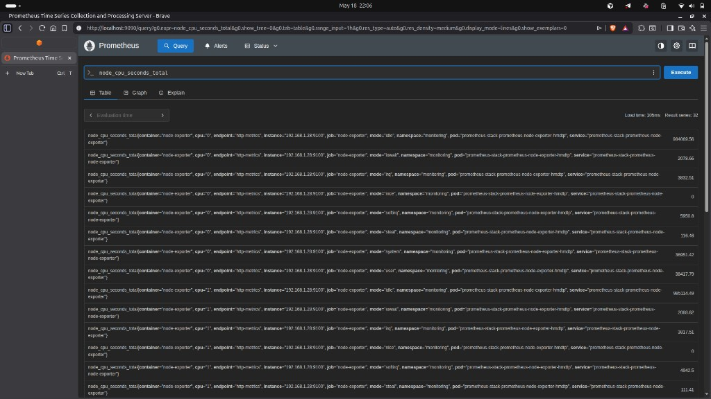
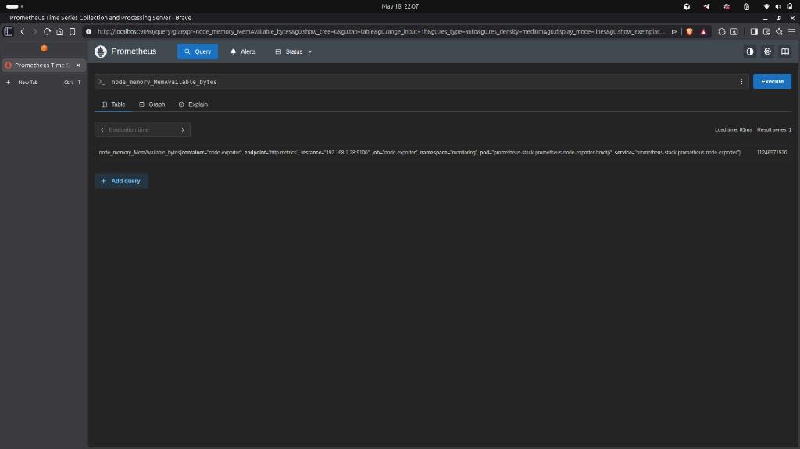
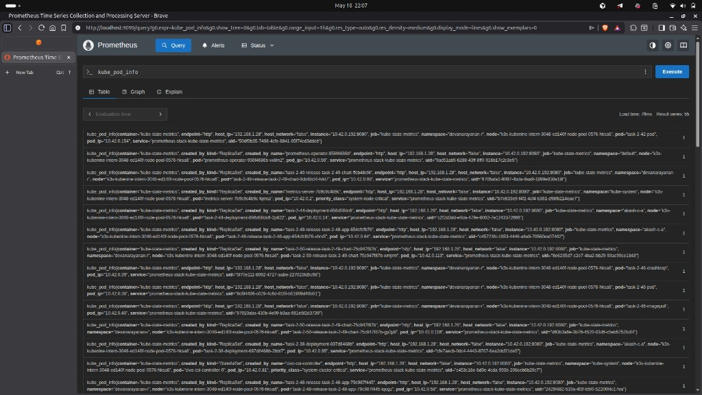
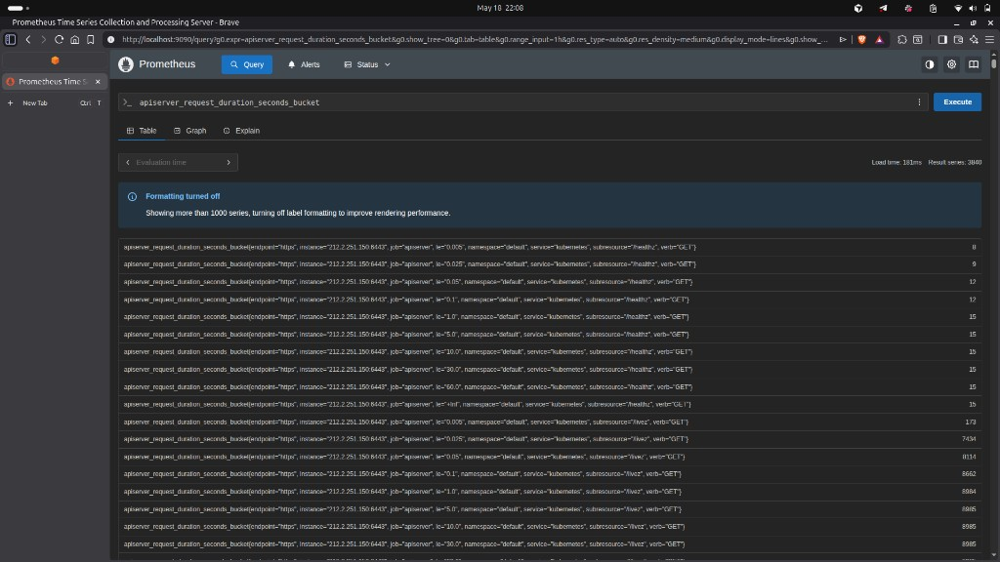
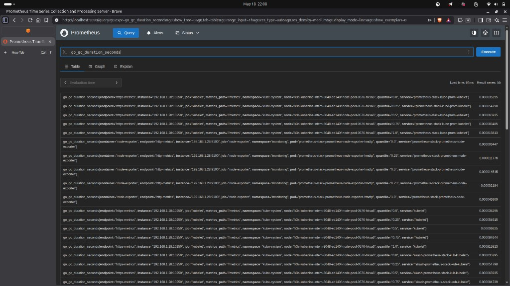

# Task 2.52 — Part 2: Learn Metric Types from the Cluster

**Deliverable:** `task-2-52-metric-types.md`

**See also:** [Part 3 — PromQL queries & screenshots](./task-2-52-promql.md) · [Part 4 — target failure](./task-2-52-target-failure.md)

---

Each metric below was queried in the Prometheus UI (**expression browser**) as an instant query (metric name only). Type comes from Prometheus exposition (`# TYPE …`), metric suffixes (`_bucket`, `_count`, …), and how values behave over time in the UI. The **screenshots show the Table view** after clicking **Execute** (you can alternately use Graph for trends).

---

## `node_cpu_seconds_total`

| | |
|---|---|
| **PromQL (instant)** | `node_cpu_seconds_total` |
| **Type** | **Counter** |
| **What it measures** | Cumulative **CPU time in seconds** spent in each mode (`idle`, `user`, `system`, …) per logical CPU — the value only increases (resets on process restart). |

#### Screenshot (Table)

**Observation:** Many series (**32** in this scrape) differing by **`cpu`** and **`mode`**; absolute values are large and increase over the life of the exporter—typical of a **counter** with **high label cardinality**.

---

## `node_memory_MemAvailable_bytes`

| | |
|---|---|
| **PromQL (instant)** | `node_memory_MemAvailable_bytes` |
| **Type** | **Gauge** |
| **What it measures** | **Bytes of memory** the kernel considers available for applications **right now** — it can rise or fall as workload and caching change. |

#### Screenshot (Table)

**Observation:** A single series for this node (**result series:** **1**) with **`instance`** / **`job`** / **`pod`** labels—a **gauge** reflecting current RAM availability.

---

## `kube_pod_info`

| | |
|---|---|
| **PromQL (instant)** | `kube_pod_info` |
| **Type** | **Gauge** (informational; value is typically **`1`**) |
| **What it measures** | One series per pod with **labels** describing that pod (`namespace`, `pod`, node, IP, …); the numeric value is a placeholder and filtering/joins use the labels. |

#### Screenshot (Table)

**Observation:** **55** rows, each **`kube_pod_info{…}`** value **`1`** — the **dimensions live in labels** (`namespace`, `pod`, `pod_ip`, `node`, …), which is typical for **kube-state-metrics** pod info exposition.

---

## `apiserver_request_duration_seconds_bucket`

| | |
|---|---|
| **PromQL (instant)** | `apiserver_request_duration_seconds_bucket` |
| **Type** | **Histogram** (`…_bucket` is the histogram bucket time series) |
| **What it measures** | **Cumulative count** of API server request durations falling in buckets labeled by `le` (upper bound), used with `_sum` / `_count` for latency rates and quantiles. |

#### Screenshot (Table)

**Observation:** Thousands of series (**3840**) because each combination of **`verb`**, **`le`**, and other dimensions is its own `_bucket` series; Prometheus may turn **off formatted label parsing** beyond ~1000 series for performance—a practical illustration of **histogram cardinality**.

---

## `go_gc_duration_seconds`

| | |
|---|---|
| **PromQL (instant)** | `go_gc_duration_seconds` |
| **Type** | **Summary** |
| **What it measures** | **Go runtime GC pause duration** with client-computed quantiles (`quantile` label); unlike a histogram, quantiles are calculated in the process that exports the metric. |

#### Screenshot (Table)

**Observation:** Multiple series keyed by **`quantile`** (**0**, **0.25**, **0.5**, **0.75**, **1**) across targets such as **`kubelet`** and **`node-exporter`**—small **seconds**-scale durations, consistent with a **summary**.
