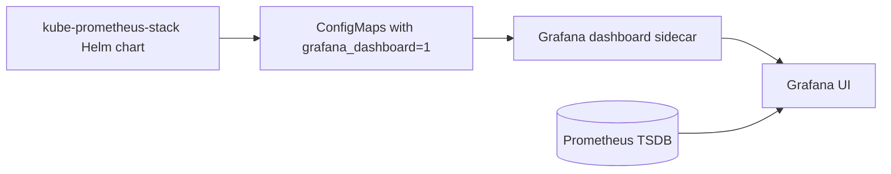

# Task 2.53 — Grafana Pre-built Dashboards

**Deliverable:** `task-2-53-dashboards.md`

**Prerequisites:** Task 2.52 complete · PromQL basics · Stack running in namespace `ayoob-monitoring` (release `ayoob-prometheus-stack`)

**Related:** [Task 2.52 — PromQL](../Task-2-52/task-2-52-promql.md) · Task 2.54 (custom dashboards, next)

**Cluster context (this deployment):**

| Item | Value |
|------|--------|
| Namespace | `ayoob-monitoring` |
| Helm release | `ayoob-prometheus-stack` |
| Grafana Service | `ayoob-prometheus-stack-grafana` |
| Grafana login | `admin` / `prom-operator` |
| Port-forward | `kubectl port-forward -n ayoob-monitoring svc/ayoob-prometheus-stack-grafana 3000:80` |

> **Note:** Task text uses `-n monitoring` and `prometheus-stack-grafana`. On this cluster, substitute **`ayoob-monitoring`** and **`ayoob-prometheus-stack-grafana`** in every command.

---

## Part 1 — Verify Dashboards Are Loaded

### Port-forward and login

```bash
kubectl port-forward -n ayoob-monitoring svc/ayoob-prometheus-stack-grafana 3000:80
```

Open http://localhost:3000 → **Dashboards** (left menu).

### Dashboard inventory (this cluster)

| Observation | Your cluster |
|-------------|----------------|
| Pre-built dashboards (ConfigMaps) | **19** (see list below) |
| Node Exporter dashboards | **Not installed** — no `node-exporter` pod and no Node Exporter ConfigMaps (see [Enable Node Exporter](#enable-node-exporter-for-part-2)) |
| Folder organisation in Grafana UI | **General** (overview, API server, CoreDNS, kubelet, pod/namespace totals), **Kubernetes / Compute Resources** (`k8s-resources-*`), **Kubernetes / Networking** (`namespace-by-*`), **Prometheus**, **Alertmanager** |

**Grafana folders map roughly to ConfigMap name prefixes:**

| Folder (UI) | ConfigMaps on this cluster |
|-------------|----------------------------|
| Alertmanager | `ayoob-prometheus-stack-kub-alertmanager-overview` |
| General | `kub-apiserver`, `kub-cluster-total`, `kub-grafana-overview`, `kub-k8s-coredns`, `kub-kubelet`, `kub-pod-total`, `kub-workload-total`, `kub-persistentvolumesusage` |
| Kubernetes / Compute Resources | `kub-k8s-resources-cluster`, `namespace`, `node`, `pod`, `workload`, `workloads-namespace`, `multicluster` |
| Kubernetes / Networking | `kub-namespace-by-pod`, `kub-namespace-by-workload` |
| Prometheus | `ayoob-prometheus-stack-kub-prometheus` |
| Node Exporter | _none until `nodeExporter.enabled: true`_ |

### ConfigMaps that carry dashboards

```bash
kubectl get configmap -n ayoob-monitoring -l grafana_dashboard=1
```

**What this shows:**

- One ConfigMap per packaged dashboard (JSON embedded in `data`).
- Label `grafana_dashboard=1` (key/value from chart defaults) marks objects the Grafana **sidecar** should load.
- Names often look like `ayoob-prometheus-stack-<dashboard-name>` (release prefix from Helm).

**Actual output (2026-05-19):**

```text
NAME                                                           DATA   AGE
ayoob-prometheus-stack-kub-alertmanager-overview               1      17m
ayoob-prometheus-stack-kub-apiserver                           1      17m
ayoob-prometheus-stack-kub-cluster-total                       1      17m
ayoob-prometheus-stack-kub-grafana-overview                    1      17m
ayoob-prometheus-stack-kub-k8s-coredns                         1      17m
ayoob-prometheus-stack-kub-k8s-resources-cluster               1      17m
ayoob-prometheus-stack-kub-k8s-resources-multicluster          1      17m
ayoob-prometheus-stack-kub-k8s-resources-namespace               1      17m
ayoob-prometheus-stack-kub-k8s-resources-node                    1      17m
ayoob-prometheus-stack-kub-k8s-resources-pod                   1      17m
ayoob-prometheus-stack-kub-k8s-resources-workload              1      17m
ayoob-prometheus-stack-kub-k8s-resources-workloads-namespace   1      17m
ayoob-prometheus-stack-kub-kubelet                             1      17m
ayoob-prometheus-stack-kub-namespace-by-pod                    1      17m
ayoob-prometheus-stack-kub-namespace-by-workload               1      17m
ayoob-prometheus-stack-kub-persistentvolumesusage              1      17m
ayoob-prometheus-stack-kub-pod-total                           1      17m
ayoob-prometheus-stack-kub-prometheus                          1      17m
ayoob-prometheus-stack-kub-workload-total                      1      17m
```

Each row is **one dashboard JSON** in `data` (single key per ConfigMap). The `grafana_dashboard=1` label is what the sidecar selects.

**Node Exporter check on this cluster:**

```bash
kubectl get pods -n ayoob-monitoring | grep -i node
# (no output — node-exporter DaemonSet not deployed)
```

### How dashboards get into Grafana (no manual import)

1. **Helm** renders dashboard JSON into **ConfigMaps** in the release namespace (and sometimes `ALL` namespaces if sidecar `searchNamespace: ALL`).
2. Grafana pod runs a **sidecar** (`k8s-sidecar` / dashboard watcher) that lists ConfigMaps with label `grafana_dashboard=1`.
3. Sidecar writes JSON into Grafana’s provisioning path; Grafana **hot-reloads** dashboards.
4. Dashboards are **declarative**: they survive Grafana pod restarts and are visible with `kubectl get configmap -l grafana_dashboard=1`.



### Enable Node Exporter (for Part 2)

Part 2 and Task 2.52 `node_*` metrics require **Node Exporter**. Your original values had `nodeExporter.enabled: false`, so the chart did not install the DaemonSet or Node Exporter Grafana dashboards.

**1. Ensure values include:**

```yaml
nodeExporter:
  enabled: true
```

**2. Upgrade (run yourself):**

```bash
helm upgrade ayoob-prometheus-stack prometheus-community/kube-prometheus-stack \
  --version 85.1.3 \
  --namespace ayoob-monitoring \
  -f ~/ayoob-monitoring-values.yaml
```

**3. Verify:**

```bash
kubectl get pods -n ayoob-monitoring | grep -i node
# expect: ayoob-prometheus-stack-prometheus-node-exporter-xxxxx  1/1  Running

kubectl get configmap -n ayoob-monitoring -l grafana_dashboard=1 | grep -i node
# expect new ConfigMaps e.g. node-exporter-full, node-rsrc-use, etc.

# In Prometheus UI (port-forward 9090): Status → Targets → node-exporter → UP
```

Refresh Grafana **Dashboards** — **Node Exporter / Nodes → Node Exporter Full** should appear after the sidecar picks up new ConfigMaps (~1–2 min).

---

## Part 2 — Node Exporter Full Dashboard

> **Status on this cluster:** Complete Part 2 **after** enabling Node Exporter above. PromQL below is from the standard dashboard; confirm in panel **Edit** on your cluster.

**Path:** Dashboards → **Node Exporter / Nodes** → **Node Exporter Full**  
**Variable:** `instance` (node) — pick your node from the dropdown.

PromQL below matches the **community “Node Exporter Full”** dashboard (Grafana.com ID 1860) bundled with kube-prometheus-stack. Your panel editor may use `$__rate_interval`, `$node`, or `$instance` — same logic.

### CPU Basic

**Typical PromQL (non-idle CPU % per mode or stacked):**

```promql
100 - (
  avg by (instance) (
    rate(node_cpu_seconds_total{instance="$instance", mode="idle"}[$__rate_interval])
  ) * 100
)
```

| Question | Answer |
|----------|--------|
| What does it measure? | **CPU utilization %** — share of time CPUs were not idle, derived from the `idle` mode counter. |
| Metric type | **`node_cpu_seconds_total`** is a **counter**; `rate()` turns it into per-second usage. The displayed % is a derived **gauge-like** visualization. |

### Memory Basic

**Typical “used” series:**

```promql
node_memory_MemTotal_bytes{instance="$instance"}
  - node_memory_MemAvailable_bytes{instance="$instance"}
```

**Often also shown:** `MemAvailable`, `Buffers`, `Cached` from `node_memory_*` gauges.

| Question | Answer |
|----------|--------|
| How is “used memory” computed? | **Total RAM minus available RAM** (`MemTotal - MemAvailable`). This matches what the kernel reports as reclaimable vs in use; it is not simply `MemFree`. |

### Disk I/O

**Read throughput:**

```promql
rate(node_disk_read_bytes_total{instance="$instance"}[$__rate_interval])
```

**Write throughput:**

```promql
rate(node_disk_written_bytes_total{instance="$instance"}[$__rate_interval])
```

| Question | Answer |
|----------|--------|
| Read vs write | **`node_disk_read_bytes_total`** (read) and **`node_disk_written_bytes_total`** (write) — both **counters**; `rate()` gives bytes/sec per device (`device` label). |

### Network Traffic Received / Transmitted

**Receive:**

```promql
rate(node_network_receive_bytes_total{
  instance="$instance",
  device!~"lo|veth.*|cali.*|docker.*|br-.*"
}[$__rate_interval])
```

**Transmit:**

```promql
rate(node_network_transmit_bytes_total{
  instance="$instance",
  device!~"lo|veth.*|cali.*|docker.*|br-.*"
}[$__rate_interval])
```

| Question | Answer |
|----------|--------|
| Labels for interface | **`device`** — regex excludes loopback and virtual bridges so the graph shows meaningful NIC traffic. |

### System Load

**Typical queries:**

```promql
node_load1{instance="$instance"}
node_load5{instance="$instance"}
node_load15{instance="$instance"}
```

| Question | Answer |
|----------|--------|
| What is load (1m / 5m / 15m)? | **Run-queue length** (processes runnable or waiting on disk) averaged over 1, 5, and 15 minutes — **gauges** from the kernel, not CPU %. |
| Metric | **`node_load1`**, **`node_load5`**, **`node_load15`** |

### Mandatory: `node_cpu_seconds_total` with 3 nodes

**Approximate series count:**  
For each node: **`(# logical CPUs) × (# modes exported)`**.  
Modes are commonly: `idle`, `user`, `system`, `iowait`, `irq`, `softirq`, `steal`, `nice` → about **8 modes × N CPUs per instance**.

**Example:** 3 nodes, 4 CPUs each, 8 modes → **3 × 4 × 8 ≈ 96** time series (plus `instance`, `job`, `mode`, `cpu` labels).

**Why so many?** The counter is split per **CPU core** and per **mode**; Prometheus stores one series per unique label set.

---

## Part 3 — Kubernetes / Compute Resources

### Cluster dashboard

**Path:** **Kubernetes / Compute Resources / Cluster**

| Concept | Meaning | Typical PromQL (simplified) |
|---------|---------|------------------------------|
| **Requests** | CPU/memory **reserved** in scheduling; sum of container `requests` | `sum(kube_pod_container_resource_requests{resource="cpu"})` |
| **Limits** | **Maximum** allowed before throttling/OOM | `sum(kube_pod_container_resource_limits{resource="cpu"})` |
| **Actual usage** | Real consumption from cAdvisor | `sum(rate(container_cpu_usage_seconds_total{container!=""}[5m]))` |

- **Scheduler** uses **requests** (and fits pods on nodes with enough allocatable capacity).
- **Limits** are enforced by the kubelet (CPU throttling, memory OOM kill).

Memory panels use the same pattern with `resource="memory"` and `container_memory_working_set_bytes` for usage.

### Namespace (Pods) — `ayoob-monitoring`

**Path:** **Kubernetes / Compute Resources / Namespace (Pods)**  
**Variable:** `namespace` = `ayoob-monitoring`

**Hands-on (fill in your observation):**

| Field | Your cluster |
|-------|----------------|
| Pod using **much less CPU than its request** | _e.g. `ayoob-prometheus-stack-kube-state-metrics-…` or a low-traffic sidecar_ |
| CPU request (approx.) | _from panel or `kube_pod_container_resource_requests`_ |
| Actual usage (approx.) | _from usage panel_ |

#### CPU throttling

| Term | Explanation |
|------|-------------|
| **What it is** | When a container hits its **CPU limit**, the Linux CFS quota **throttles** the process — it gets less run time than it wants. |
| **Symptom** | App latency rises while usage looks “below limit” on averages; `container_cpu_cfs_throttled_seconds_total` increases. |
| **How this dashboard surfaces it** | Compare **usage vs request vs limit** panels; pods **over limit** show throttling in dedicated rows or in **Namespace (Workloads)** / pod detail; sustained high usage at the limit boundary implies throttling. |

### Pod dashboard — container breakdown

**Path:** **Kubernetes / Compute Resources / Pod**  
**Variables:** `namespace`, `pod`

**How Grafana knows containers:** Prometheus metrics from cAdvisor include label **`container`** (container name; `container=""` is the pod sandbox). **`pod`** and **`namespace`** tie series to a workload. Example:

```promql
sum by (container) (
  rate(container_cpu_usage_seconds_total{
    namespace="$namespace",
    pod="$pod",
    container!=""
  }[$__rate_interval])
)
```

---

## Part 4 — Kubernetes / Networking

**Path:** **Kubernetes / Networking / Namespace (Pods)**  
**Variable:** `namespace` = `ayoob-monitoring`

### Current Receive Bandwidth

**Typical PromQL (kubernetes-mixin style):**

```promql
sum(
  rate(container_network_receive_bytes_total{
    namespace="$namespace",
    pod=~"$pod"
  }[$__rate_interval])
) by (pod)
```

| Item | Detail |
|------|--------|
| **Metric** | `container_network_receive_bytes_total` (**counter**) |
| **Labels** | `namespace`, `pod` (and often `interface`); aggregated with `sum by (pod)` |
| **Unit** | Bytes/sec after `rate()` |

Transmit panel uses **`container_network_transmit_bytes_total`**.

### Why use this in a production network incident?

- See **which pods** in a namespace drive inbound traffic **right now**.
- Compare pods side-by-side without SSH or `tcpdump` on nodes.
- Correlate spikes with deploys (label `pod` changes) or a noisy neighbor in the same namespace.
- Complements Node Exporter (host NIC totals) with **per-workload** Kubernetes accounting.

---

## Part 5 — Alertmanager / Overview

**Path:** **Alertmanager / Overview**

| Stat panel (typical) | What it shows |
|----------------------|----------------|
| **Alerts received** | Rate/count of alerts ingested by Alertmanager (`alertmanager_alerts_received_total` or similar) |
| **Alerts sent / notifications** | Notifications dispatched to receivers (`alertmanager_notifications_total`) |
| **Notification latency** | Time to deliver notifications (`alertmanager_notification_latency_seconds`) |

**When no alerts are firing:** Panels are **low or flat** — near zero receive rate, few notifications, low latency. Gauges may show “0” active alerts.

**When an alert is active:**

- **Received** rate increases as Prometheus sends firing alerts.
- **Sent** increases as Alertmanager routes to Slack/email/webhook receivers.
- **Latency** shows how long notification delivery takes (useful if pages are delayed).

Use this dashboard to verify **Alertmanager is healthy** (receiving and routing), not to see application CPU (that is Prometheus / workload dashboards).

---

## Part 6 — Gaps (input for Task 2.54)

At least **three** operational views **not** covered well by defaults:

| # | Gap | Why a custom dashboard (Task 2.54) helps |
|---|-----|------------------------------------------|
| 1 | **Single application / team namespace SLO view** | Default dashboards are cluster- or generic namespace-scoped; no “my service” golden signals (latency, errors, traffic) in one row. |
| 2 | **Logs + metrics together** | Pre-built dashboards are Prometheus-only; no **Loki** log volume/error rate next to CPU/memory (requires Loki stack). |
| 3 | **Restarts + resources in one place** | Restart counts (`kube_pod_container_status_restarts_total`) live in different panels than CPU/memory; on-call wants “unstable and hot” pods in one table. |

_Add your own third gap if you prefer (e.g. PVC disk fullness per app, cost by namespace, canary vs stable)._ 

---

## Mandatory Questions

### 1. How do pre-built Grafana dashboards get loaded automatically?

Via **Helm-created ConfigMaps** labeled `grafana_dashboard=1`. The Grafana **sidecar** watches those ConfigMaps and **provisions** dashboards into Grafana without manual JSON import.

### 2. What is Node Exporter and how does it expose host metrics?

**Node Exporter** is a Prometheus exporter that reads **Linux host** stats (CPU, memory, disk, network, load) and exposes them as Prometheus metrics on `/metrics`. In kube-prometheus-stack it usually runs as a **DaemonSet** so every node is scraped.

### 3. CPU requests vs limits — which does the scheduler use?

| | **Request** | **Limit** |
|---|-------------|-----------|
| Purpose | Guaranteed/minimum reserved for scheduling | Hard cap for runtime |
| Scheduler | **Uses requests** to place pods on nodes with enough allocatable CPU | Ignored for placement |
| Enforcement | Bin-packing / quota | **Throttling** (CPU) or **OOM kill** (memory) |

### 4. What is CPU throttling?

When usage hits the **CPU limit**, the kernel **restricts** CPU time (CFS throttling). The app slows down (higher latency) even if the node has spare CPU.

### 5. What is kube-state-metrics and why separate from cAdvisor?

**kube-state-metrics** exposes **Kubernetes object state** from the API (pod phase, requests, limits, replicas, labels). **cAdvisor** exposes **container resource usage** from the node. You need both: KSMD for **desired/designed** capacity, cAdvisor for **actual** consumption.

### 6. cAdvisor vs Node Exporter

| | **Node Exporter** | **cAdvisor** (via kubelet) |
|---|-------------------|----------------------------|
| Scope | **Whole node** (host kernel) | **Per-container** / pod cgroup |
| Examples | `node_cpu_seconds_total`, `node_memory_*` | `container_cpu_usage_seconds_total`, `container_memory_working_set_bytes` |
| Use | “Is the machine healthy?” | “Which container is using CPU?” |

### 7. What is a Grafana dashboard variable?

A **template variable** (dropdown) such as `$namespace` or `$pod`. Changing it **substitutes** into all panel PromQL queries so one dashboard works for many workloads.

### 8. Why is Node Exporter Full useful when an app is slow?

It separates **node problems** (disk saturation, network errors, high load, memory pressure) from **app problems**. If node metrics are healthy but the app is slow, suspicion moves to app code, DB, or limits/throttling — not the hardware.

### 9. What does the Alertmanager dashboard show and when use it?

Alert **ingest**, **notification**, and **latency** health. Use during **alerting incidents** (pages not sent, duplicate alerts, slow Slack/email) — not for container CPU debugging.

### 10. Most important question NO pre-built dashboard answers (example answer)

**“Is my specific service meeting its error-rate and latency SLO this hour, and which deployment caused the regression?”**

Pre-built dashboards show **infrastructure** (CPU, memory, network, Kubernetes state) but not **application-level SLIs** (HTTP 5xx %, p99 latency per route) unless you add custom instrumentation and dashboards (Task 2.54).

---

## Verification Checklist

- [ ] `kubectl get configmap -n ayoob-monitoring -l grafana_dashboard=1` run and described
- [ ] Node Exporter Full: 5 panels documented with PromQL
- [ ] Compute Resources: requests vs limits vs usage + throttling + container label
- [ ] Networking: receive bandwidth PromQL documented
- [ ] Alertmanager: stat panels documented
- [ ] ≥3 gaps listed for Task 2.54
- [ ] All mandatory questions answered
- [ ] Optional: screenshots under `Task-2-53/` for your submission

---

## Reference links (mandatory)

- [Grafana Full Introduction](https://www.youtube.com/watch?v=lILY8eSspEo)
- [Grafana Dashboards and Panels](https://www.youtube.com/watch?v=YUabB_7H710)
- [kube-prometheus-stack chart](https://github.com/prometheus-community/helm-charts/tree/main/charts/kube-prometheus-stack)
- [Node Exporter metrics](https://github.com/prometheus/node_exporter)
- [kube-state-metrics pod metrics](https://github.com/kubernetes/kube-state-metrics/blob/main/docs/metrics/workload/pod-metrics.md)
- [Grafana variables](https://grafana.com/docs/grafana/latest/dashboards/variables/)
